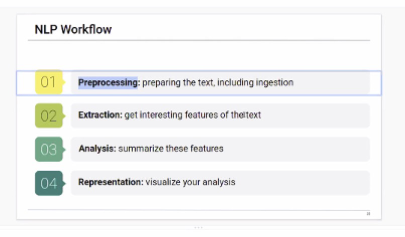

# Project 2 

---

## Natural Language Processing & Machine Learning

###  Statement

In our current ‘political and financial’ environments we are using words either written or spoken, instead of numbers to determine outcomes. 

Humans communicate in unstructured ways, and because it is not very clear for computers to interpret, natural language processing (NLP) is a solution used to help computers understand the unstructured text and retrieve meaningful pieces of information from it for us Humans to then understand quickly and maybe even more "trusted"

###  What will be done

Natural language Processing (NLP) is a subfield of artificial intelligence, in which its depth involves the interactions between computers and humans.

my project proposal is to take paragraphs of documentation, from published articles of a ‘charged’ financial / stock market related topic ( like Tesla), and utilize Python with ML and NLP capabilities for the ‘machine’ to tell me in a short summary, what is the core topic being conveyed in the articles. 

for example: the URL article below gives opinion to IF a stock market crash is coming. 

I dont want the machine to predict the crash but with additional articles given,determine in a summary sentence what is the ‘essence’ of the articles being discussed. 

https://medium.com/yardcouch-com/is-a-crash-coming-comparing-todays-stock-market-to-the-dot-com-bubble-d2683ebe28d7

Approaches to the python jupyter notebook program include what we learned in module 12.x and possibly the usage of TensorFlow, which we were exposed to in neural networks and possibly maybe even the IBM Tone Analyzer. 

https://www.tensorflow.org/overview/

https://cloud.ibm.com/catalog/services/tone-analyzer

---

