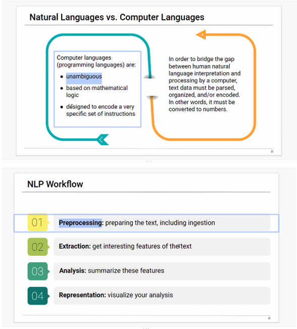

# Project 2 

---

## Natural Language Processing & Machine Learning

###  Statement

In our current ‘political and financial’ environments we are using words either written or spoken, instead of numbers to determine outcomes. 

Humans communicate in unstructured ways, and because it is not very clear for computers to interpret, natural language processing (NLP) is a solution used to help computers understand the unstructured text and retrieve meaningful pieces of information from it for us Humans to then understand quickly and maybe even more "trusted"

###  What will be done

Natural language Processing (NLP) is a subfield of artificial intelligence, in which its depth involves the interactions between computers and humans.

my project proposal is to take tweets from twitter based on tesla, and utilize Python with ML and NLP capabilities for the ‘machine’ to tell analyze and come up with sentiment on those tweets. I shall capture 5 days worth of data. 

Then take Stock Market data of that same data sample, and combine the sentiment analysis with the market data and show a correlation between the two data sets. 

Special Thanks to [Kyle Cloud](https://github.com/kylestormcloud) for the creativity discussion!

---

